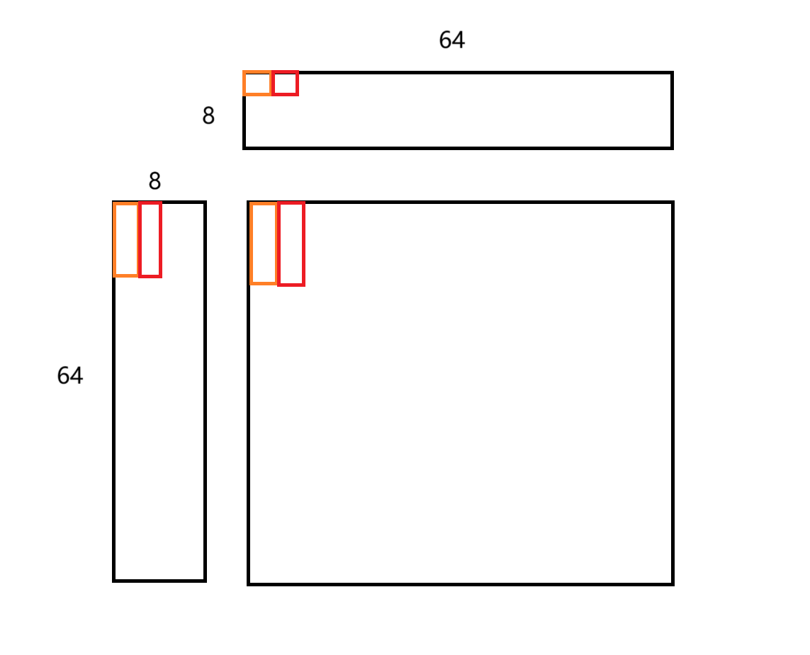

## CUDA_GEMM

进行一个简单的CUDA_GEMM的训练。目前实现了版本v0, v1

## naive impl v0

最简单的划分方式：每个线程负责一个C矩阵的元素，然后每个线程对1行和1列的元素进行点积操作。

## MatrixMulSharedMemKernel_v1

使用共享内存加速，tiling成16*16的block，来加速矩阵的读取，但目前每个线程仍处理其中一个部分的内容。只快了一点点。

```sh
Running basic version:
size: 1024, check: 1
Warming up...
Kernel Elapsed Time: 0.694 ms
Performance= 3092.23 GFlop/s, Time= 0.694 msec, Size= 2147483648 Ops
Computing result using host CPU...done.
Listing first 100 Differences > 0.000010...
 
  Total Errors = 0

Running optimized version:
Grid: (64, 64)
Block: (16, 16)
Warming up...
Kernel Elapsed Time: 0.605 ms
Performance= 3547.28 GFlop/s, Time= 0.605 msec, Size= 2147483648 Ops
Computing result using host CPU...done.
Listing first 100 Differences > 0.000010...
 
  Total Errors = 0
```

有一个实现上的细节是使用[ty][tx]的下标，这样能保证同一个warp对A的访存基本是连续的，如果使用[tx][ty]的下标方式，局部性非常的差，甚至会跑的比baseline烂。

## MatrixMulSharedMemKernel_v2

每个线程可以负责多个元素的计算，这样shared memory加载的内容可以进行复用。(可以利用ncu分析一下)


可以看到计算单元实际利用率很低！并且流水线基本stall在数据依赖上了（等待shm的加载）

这个kernel把矩阵乘的内积计算方式改成了外积计算，理解上相对没前面两个kernel那么简单直观，最好是画出来。图中红色和橙色是两个相邻的线程。



这样子的计算方式下，A，B数组的总load次数不变，但是均摊到C的每一个元素的load次数变少了（因为每次load都给C的多个元素进行计算），也就是说计算强度增大了（每个byte的load的compute次数增多了）

不妨进行量化的计算，假设A:[1024,1024], B:[1024,1024], C:[1024,1024], 采用这样的切分策略：grid(16,16), block(64, 8)，也就是说一个线程计算C的8个元素。（对应A矩阵中每个block计算时的大小为[64, 8], B矩阵中每个block计算时的大小为[8, 64], C矩阵中每个block计算时的大小为[64, 64]）

对于每个线程，如果使用原本的内积的计算方法（假设切分为grid(16,16), block(64, 64)）：

- 每次对于global memory的load: 1024/64次循环，每个循环2个load
- 对于shared memory的load：1024/64次循环，每次循环64*2次load

使用外积的计算方式：

- 每次对于global memory的load：1024/8次循环，每个循环2个load，但是由于线程少了，要再除一个均摊的8次
- 每次对于shared memory的load：1024/8次循环，*内部8次的循环，再乘上内部(1+8)次的load，但是可以除掉一个线程数减少带来的8的均摊

可以看到**单个线程加载的内容并没有减少，但是线程总量减少了，且总计算量不变，意味着单个线程的计算强度增加了。**

```sh
Running optimized version:
Grid: (16, 16)
Block(y, x): (1, 512)
Warming up...
Kernel Elapsed Time: 0.296 ms
Performance= 7246.55 GFlop/s, Time= 0.296 msec, Size= 2147483648 Ops
Computing result using host CPU...done.
Listing first 100 Differences > 0.000010...
 
  Total Errors = 0
```

快了一倍。此时再看ncu的结果，可以发现纵坐标已经显著变小了，并且内存阻塞已经不是最大的问题了。FMA单元的利用率也从25%提升到了50%左右。


